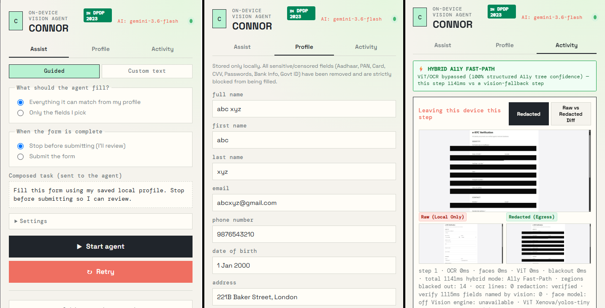

# CONNOR 🛡️

**CONNOR** is an on-device, privacy-preserving visual AI agent designed for secure browser automation. It enables Vision-Language Models (VLMs) like Gemini and OpenAI to intelligently assist with and automate web form filling—without ever exposing your sensitive Personal Identifiable Information (PII), credentials, or private data to external AI servers.

---

## 🗣️ Key Features
- **Zero-PII Processing**: Personal information (PII) is detected and stored locally on the user's device and is redacted before screenshots or data are sent to a cloud LLM.
- **Multi-Layer Detection**: Combines DOM accessibility trees, on-device OCR (Tesseract WASM), and MediaPipe BlazeFace detection for comprehensive coverage.
- **Fail-Closed Verification Gate**: Re-scans masked visuals before egress to ensure zero accidental data leakage.
- **Action Firewall**: Validates and sandboxes all actions suggested by the AI agent prior to execution in your browser.
- **Seamless Browser Extension**: Intuitive Chrome/Firefox Manifest V3 extension featuring profile management, live activity logging, and step-by-step approval controls.
- **Flexible VLM Backend**: Plug-and-play backend compatible with Google Gemini, OpenAI, or local/mock models.

---

## 🏗️ How It Works

```text
[ Web Page / Form ]
        │
        ▼
[ CONNOR Extension ] ──( On-Device OCR & Face Detection )
        │                  ──( Blackout Redaction & Verification )
        │                  ──( DOM Skeleton Stripping )
        ▼
[ Redacted Visual + Skeleton ] (Zero Real PII)
        │
        ▼
[ FastAPI Backend + VLM ] ────( Gemini / OpenAI / Mock )
        │
        ▼
[ Proposed Actions ]
        │
        ▼
[ Extension Action Firewall ] ──( User Approval & Safe DOM Execution )
```

---
## Screenshots

---

## 🚀 Quick Start

### Prerequisites
- Python 3.10+
- Node.js 18+


### 1. Start the Backend Server

```bash
# Set up Python virtual environment
python -m venv .venv

# Windows
.\.venv\Scripts\activate

# Linux / macOS
source .venv/bin/activate

# Install dependencies
pip install -r server/requirements.txt

# Start the FastAPI server
python -m uvicorn main:app --app-dir server --port 8000
```

> **API Key Setup**: Add your `GEMINI_API_KEY` or `OPENAI_API_KEY` to `server/.env`. You can also set `VLM_MODE=mock` for local testing without an API key.

---

### 2. Load the Browser Extension

1. Open Chrome and navigate to `chrome://extensions/`.
2. Enable **Developer mode** in the top-right corner.
3. Click **Load unpacked** and select the `client/` folder in this repository.

---

### 3. (Optional) Run Test Fixtures

Test the extension against sample demo forms (KYC, Job Application, Checkout):

```bash
node scripts/serve.mjs fixtures 4173
```
Visit `http://localhost:4173/` in your browser.

---

## 📁 Project Structure

```text
├── client/                     # MV3 browser extension (Chrome & Firefox)
│   ├── manifest.json           # Extension manifest
│   ├── background.js           # Background service worker & orchestrator
│   ├── content.js              # DOM inspector and listener
│   ├── executor.js             # Safe form execution engine
│   ├── popup.html / .js        # Extension dashboard UI
│   ├── offscreen.html / .js    # OCR & vision inference worker
│   └── lib/                    # Detection, redaction & security policy modules
├── server/                     # FastAPI backend
│   ├── main.py                 # Core API routes (/health, /privacy, /agent/step)
│   ├── schema.py               # Data schemas
│   └── vlm.py                  # Vision-Language Model integrations
├── fixtures/                   # Sample test forms for demonstration
└── tests/                      # Core test suites
```

---

## 📄 License

This project is open-source and distributed under the [MIT License](LICENSE).
